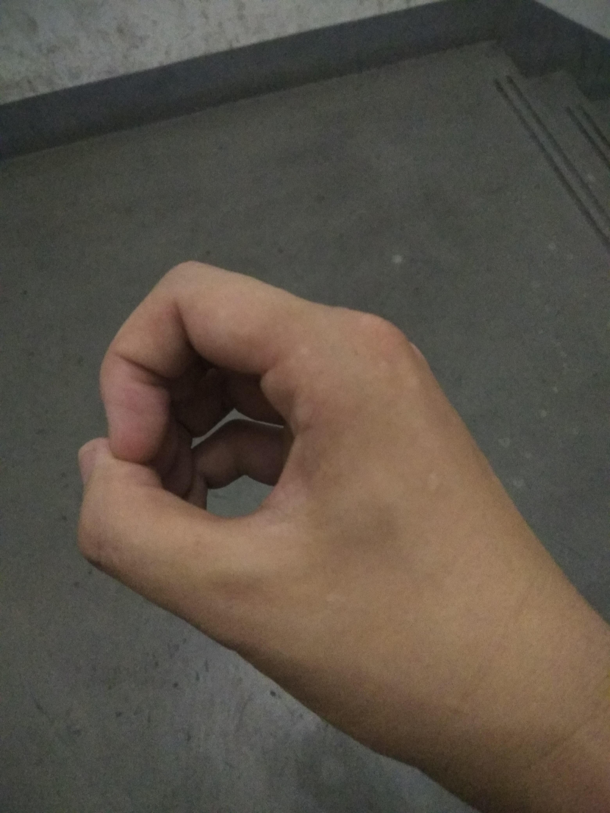
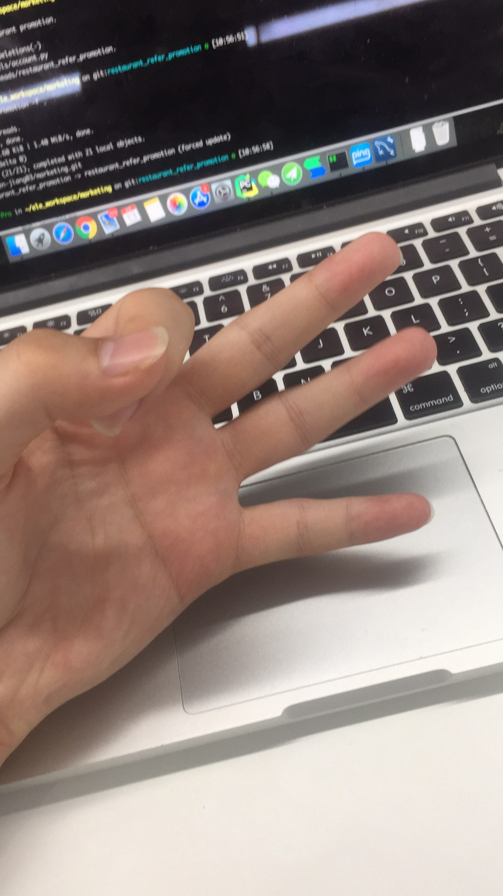
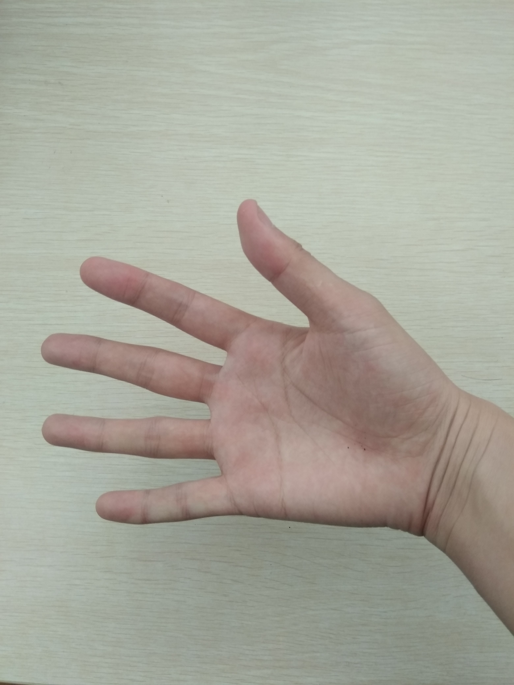
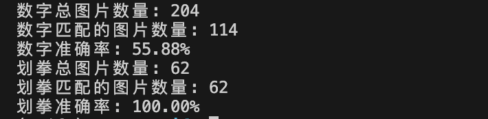

### 数据集介绍
收集了0-10手势图片xx张，分别用0_x;1_x 2_x;3_x表示：

手势0：




手势1：


手势2 / 剪刀：


手势3：





手势5/ 布：





由于其中10，2, 5数字的手势和图片一样，因此也将他们作为石头，剪刀布的训练和测试图片；

从所有数据中每一个类别取一张作为训练数据集，其他的则作为测试数据集。
因此，训练数据集构建为：

```
{"query": "<image>请问图片中表示的是0-10中的哪一个手势？", "response": "0", "images": ["/media/sdd/lzy/mllm/train/0.jpg"]}
{"query": "<image>请问图片中表示的是0-10中的哪一个手势？", "response": "1", "images": ["/media/sdd/lzy/mllm/train/1.jpg"]}
{"query": "<image>请问图片中表示的是0-10中的哪一个手势？", "response": "2", "images": ["/media/sdd/lzy/mllm/train/2.jpg"]}
{"query": "<image>请问图片中表示的是0-10中的哪一个手势？", "response": "3", "images": ["/media/sdd/lzy/mllm/train/3.jpg"]}
{"query": "<image>请问图片中表示的是0-10中的哪一个手势？", "response": "4", "images": ["/media/sdd/lzy/mllm/train/4.jpg"]}
{"query": "<image>请问图片中表示的是0-10中的哪一个手势？", "response": "5", "images": ["/media/sdd/lzy/mllm/train/5.jpg"]}
{"query": "<image>请问图片中表示的是0-10中的哪一个手势？", "response": "6", "images": ["/media/sdd/lzy/mllm/train/6_1.jpg"]}
{"query": "<image>请问图片中表示的是0-10中的哪一个手势？", "response": "7", "images": ["/media/sdd/lzy/mllm/train/7.jpg"]}
{"query": "<image>请问图片中表示的是0-10中的哪一个手势？", "response": "8", "images": ["/media/sdd/lzy/mllm/train/8.jpg"]}
{"query": "<image>请问图片中表示的是0-10中的哪一个手势？", "response": "9", "images": ["/media/sdd/lzy/mllm/train/9.jpg"]}
{"query": "<image>请问图片中表示的是0-10中的哪一个手势？", "response": "10", "images": ["/media/sdd/lzy/mllm/train/10.jpg"]}
{"query": "<image>请问图片中的手势表示的是“石头，剪刀，布”中的哪一种？", "response": "石头", "images": ["/media/sdd/lzy/mllm/train/10.jpg"]}
{"query": "<image>请问图片中的手势表示的是“石头，剪刀，布”中的哪一种？", "response": "布", "images":   ["/media/sdd/lzy/mllm/train/5.jpg"]}
{"query": "<image>请问图片中的手势表示的是“石头，剪刀，布”中的哪一种？", "response": "剪刀", "images": ["/media/sdd/lzy/mllm/train/2.jpg"]}
```

模型基于swift框架

```
# Full capabilities
pip install 'ms-swift[all]' -U
# LLM only
pip install 'ms-swift[llm]' -U
# AIGC only
pip install 'ms-swift[aigc]' -U
# Adapters only
pip install ms-swift -U
```

Instruct tuning 训练代码：

```
MAX_PIXELS=602112 CUDA_VISIBLE_DEVICES=1 swift sft \
  --model_type qwen2-vl-7b-instruct \
  --model_id_or_path qwen/Qwen2-VL-7B-Instruct \
  --sft_type lora \
  --dataset train.jsonl \
--val_dataset eval.jsonl    --num_train_epochs 39 --eval_steps 1
```

推理和评测代码：

模型路径：https://share.weiyun.com/gkGMApk0


```python
import os
os.environ['CUDA_VISIBLE_DEVICES'] = '0'

from swift.llm import (
    get_model_tokenizer, get_template, inference, ModelType,
    get_default_template_type, inference_stream
)
from swift import Swift
import torch
from swift.utils import seed_everything
import torch
model_type = ModelType.qwen2_vl_7b_instruct
template_type = get_default_template_type(model_type)

print(f'template_type: {template_type}')

model, tokenizer = get_model_tokenizer(model_type, torch.bfloat16,
                                       model_kwargs={'device_map': 'auto'})
model = Swift.from_pretrained(model, '/media/sdd/lzy/mllm/ms-swift/output/qwen2-vl-7b-instruct/v7-20241120-163331/checkpoint-17')
model.generation_config.max_new_tokens = 256
template = get_template(template_type, tokenizer)
total_images = 0
matched_images = 0

total_images_1 = 0
matched_images_1 = 0

dict_map = {"10":"石头",
                "2":"剪刀",
                "5":"布"}
for img_path in os.listdir("/media/sdd/lzy/mllm/picture"):
        query = f"""/media/sdd/lzy/mllm/picture/{img_path}</img>请问图片中表示的是0-10中的哪一个手势？"""
        response, history = inference(model, template, query)
        print(f'query: {query}')
        print(f'response: {response}')
        total_images += 1
        number_part = img_path.split('_')[0]
        if number_part == response:
            matched_images += 1

        if number_part in ["10","2","5"]:
            query = f"""/media/sdd/lzy/mllm/picture/{img_path}</img>图请问图片中的手势表示的是“石头，剪刀，布”中的哪一种？"""
            response, history = inference(model, template, query)
            print(f'query: {query}')
            print(f'response: {response}')
            total_images_1 += 1
            number_part = img_path.split('_')[0]
            print(number_part, dict_map[number_part])
            if dict_map[number_part] == response:
                matched_images_1 += 1
if total_images > 0:
    accuracy = matched_images / total_images
else:
    accuracy = 0

if total_images > 0:
    accuracy_1 = total_images_1 / total_images_1
else:
    accuracy_1 = 0
print(f"数字总图片数量: {total_images}")
print(f"数字匹配的图片数量: {matched_images}")
print(f"数字准确率: {accuracy:.2%}")


print(f"划拳总图片数量: {total_images_1}")
print(f"划拳匹配的图片数量: {total_images_1}")
print(f"划拳准确率: {accuracy_1:.2%}")
```
准确率
